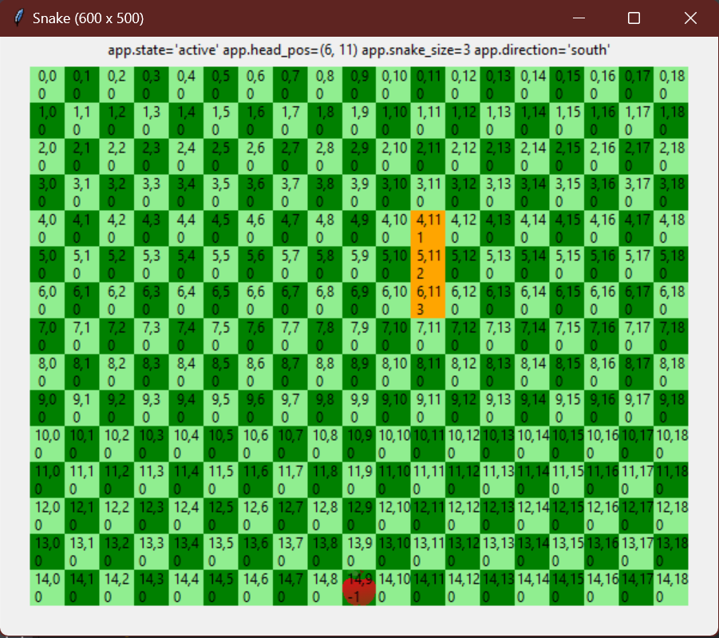

# Python Snake Game

Welcome to the Python Snake Game! This is a graphical version of the classic Snake game, where you control a growing snake on a grid while avoiding walls and your own tail. The game features a start screen, a debug mode for extra insights, and a simple scoring system that tracks your best performance.

## Features
- **Classic Snake Gameplay**: Use arrow keys to control the snake and eat apples to grow in size.
- **Start Screen**: The game begins with a start screen, and the game starts when any key is pressed.
- **Game Over**: The game ends if the snake hits a wall or its own body.
- **Top Score**: Your score is tracked, and the highest score is saved and displayed.
- **Debug Mode**: Toggle the debug mode by pressing the `D` key to show extra information like the snake’s position and direction.

## Screenshots

### Start Screen


### In-Game Screenshot


### Debug Mode


## Controls

- **Arrow Keys**: Control the snake (up, down, left, right).
- **Space**: Move the snake (for testing purposes).
- **R Key**: Restart the game after a game over.
- **D Key**: Toggle debug mode to display additional game information.

## How to Play
1. **Starting the Game**: The game starts with a start screen. Press any key to begin.
2. **Game Objective**: Control the snake to eat apples and grow. The snake moves automatically, and you need to guide it with arrow keys. 
3. **Scoring**: Each apple increases your score by 1 point. Avoid hitting walls or the snake’s own body.
4. **Game Over**: The game ends when you collide with a wall or your own snake’s body. Press `R` to restart the game.

## Installation

### Prerequisites
- Python 3.x
- Required Libraries: `uib_inf100_graphics`, `random`

### Clone the repository

```bash
git clone https://github.com/your-username/snake-game.git
cd snake-game
```

Install required dependencies
Make sure you have installed the required libraries. For example, you can install dependencies via pip:
```bash
pip install uib_inf100_graphics
```

Run the game
```bash
python snake_game.py
```

## File Structure
- **snake_game.py**: The main game logic and application functions.
- **snake_view.py**: Contains functions for drawing the game board and displaying the start screen.
- **pictures**: Folder containing images used for apples and the start screen (e.g., apple.png, start_screen.png).

## Game Logic
### Main Components
- Snake Movement: The snake's head position updates based on the current direction, and its body grows when it eats an apple.
- Collision Detection: The game checks whether the snake's head collides with a wall or its own body to trigger a game over.
- Board Update: The game board is updated with each move, keeping track of the snake's position and apples.

### Debug Mode
  In debug mode, additional information about the snake's position, size, and direction is displayed on the screen. Use this mode to see how the snake interacts with the game board.
